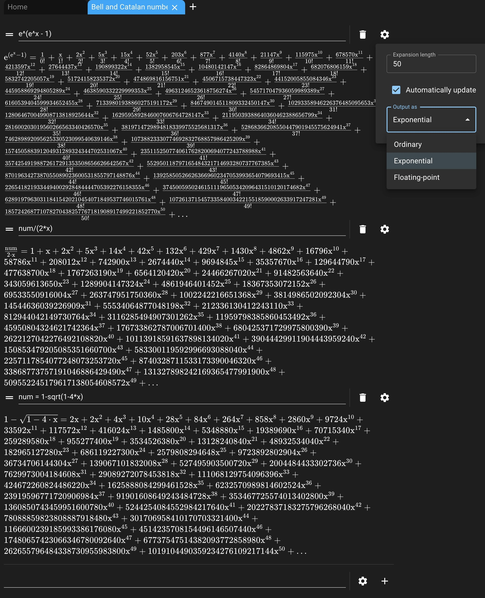

# Series Explorer

A tool to evaluate [generating functions](https://en.wikipedia.org/wiki/Generating_function) (or your usual Taylor series) in the browser. It's multithreaded and uses Karatsuba multiplication for large enough polynomials. [Try it out yourself](https://thomasqm.com/series/)!

For example, you can easily compute the Bell and Catalan numbers:
